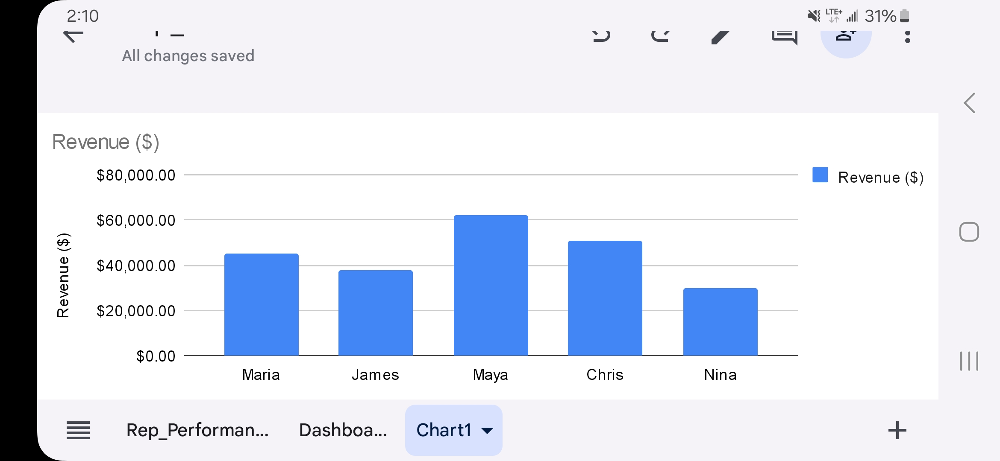
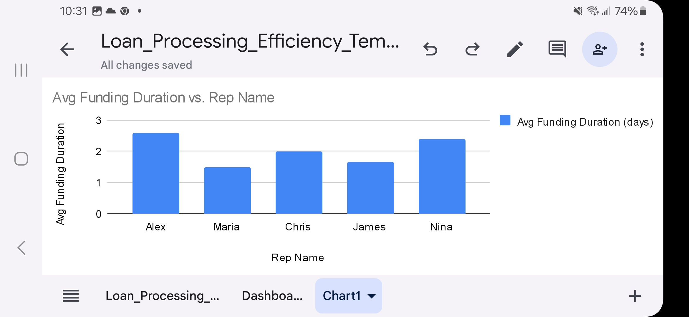

# Sales Performance Analysis – Revenue by Rep & Lead Source

## Objective  
To analyze the performance of sales representatives and lead sources based on deal volume, revenue, and efficiency.

## Tools Used  
- Google Sheets 
- Excel formulas (VLOOKUP, basic math)  
- Charts: Bar, Column, and Pie  
- Mobile Screenshots for dashboard visual

## Key Metrics Analyzed  
- Revenue per Rep  
- Close Rate (%)  
- Average Revenue per Deal  
- Sales Cycle Duration  
- Lead Source Conversion

## Insights  
- Maya generated the highest revenue ($62K) with a 64% close rate, largely from referrals.  
- LinkedIn leads showed strong conversions and mid-tier sales cycles.  
- Website leads had the slowest cycle and lowest revenue per deal.  
- Reps with higher deal efficiency (like Maya and Chris) performed better even with fewer leads.

## Next Steps / Recommendations  
- Allocate more leads to top performers.  
- Double down on referral and LinkedIn channels.  
- Consider automating outreach for underperforming lead sources.

## Screenshot Preview  

---

## Loan Processing Efficiency Dashboard – GitHub Project

Built a mobile-first loan efficiency dashboard using Google Sheets and Excel to analyze funding delays. Used sample loan data to measure average funding duration by rep. Created a chart and surfaced insights + recommendations to improve operational workflows.

### Key Metrics:
- Avg. Funding Duration by Rep
- Performance Variance

### Tools Used:
- Google Sheets 
- Excel formulas (DATEDIF, AVERAGEIF)
- Bar chart visualization
- Manual insights + strategy write-up

### Summary of Insights:
- Alex had the slowest avg funding at 2.6 days — needs process review.
- Maria had the fastest avg at 1.5 days — could be a model for others.
- Variability in rep performance suggests workflow standardization.

### Recommendations:
- Interview top performers to document efficient workflows.
- Use automation or SOPs to reduce handoff delays.
- Train reps using a Loan Ops Playbook.
